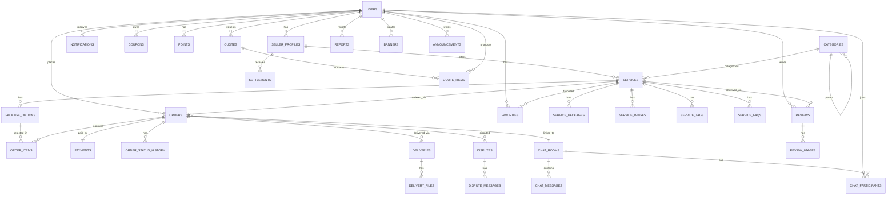

# DB 스키마 설계

## 1. 개요

| 항목 | 선택 |
|------|------|
| **DBMS** | PostgreSQL 15+ |
| **ORM** | Prisma 5+ |
| **캐시** | Redis |
| **검색엔진** | Elasticsearch |
| **파일 저장** | AWS S3 |

---

## 2. ERD (Mermaid)

---

## 3. 테이블 정의서

### 3.1 users (사용자)

| 컬럼명 | 타입 | 제약조건 | 설명 |
|--------|------|----------|------|
| id | BIGSERIAL | PK | 사용자 ID |
| email | VARCHAR(100) | UNIQUE, NOT NULL | 이메일 |
| password_hash | VARCHAR(255) | NULL | 비밀번호 해시 (소셜 로그인 시 NULL) |
| nickname | VARCHAR(20) | UNIQUE, NOT NULL | 닉네임 |
| profile_image_url | VARCHAR(500) | NULL | 프로필 이미지 URL |
| phone | VARCHAR(20) | NULL | 휴대폰 번호 |
| user_type | ENUM | NOT NULL | 'BUYER', 'SELLER', 'ADMIN' |
| status | ENUM | NOT NULL, DEFAULT 'ACTIVE' | 'ACTIVE', 'SUSPENDED', 'DORMANT', 'WITHDRAWN' |
| email_verified | BOOLEAN | DEFAULT FALSE | 이메일 인증 여부 |
| phone_verified | BOOLEAN | DEFAULT FALSE | 전화번호 인증 여부 |
| marketing_agreed | BOOLEAN | DEFAULT FALSE | 마케팅 수신 동의 |
| last_login_at | TIMESTAMP | NULL | 최근 로그인 |
| nickname_changed_at | TIMESTAMP | NULL | 닉네임 변경일 |
| withdrawn_at | TIMESTAMP | NULL | 탈퇴일 |
| created_at | TIMESTAMP | DEFAULT NOW() | 가입일 |
| updated_at | TIMESTAMP | DEFAULT NOW() | 수정일 |

### 3.2 social_accounts (소셜 계정 연동)

| 컬럼명 | 타입 | 제약조건 | 설명 |
|--------|------|----------|------|
| id | BIGSERIAL | PK | |
| user_id | BIGINT | FK(users), NOT NULL | 사용자 ID |
| provider | ENUM | NOT NULL | 'KAKAO', 'NAVER', 'GOOGLE', 'APPLE' |
| provider_id | VARCHAR(100) | NOT NULL | 소셜 제공자 사용자 ID |
| created_at | TIMESTAMP | DEFAULT NOW() | |

**UNIQUE**: (provider, provider_id)

### 3.3 seller_profiles (판매자 프로필)

| 컬럼명 | 타입 | 제약조건 | 설명 |
|--------|------|----------|------|
| id | BIGSERIAL | PK | |
| user_id | BIGINT | FK(users), UNIQUE, NOT NULL | 사용자 ID |
| seller_type | ENUM | NOT NULL | 'INDIVIDUAL', 'BUSINESS' |
| grade | ENUM | DEFAULT 'NEW' | 'NEW', 'GENERAL', 'PRO', 'MASTER' |
| bio | TEXT | NULL | 상세 소개 |
| short_bio | VARCHAR(200) | NULL | 한 줄 소개 |
| specialties | JSONB | NULL | 전문 분야 태그 배열 |
| career | JSONB | NULL | 경력 사항 배열 |
| bank_name | VARCHAR(20) | NULL | 정산 은행 |
| bank_account | VARCHAR(30) | NULL | 정산 계좌 |
| bank_holder | VARCHAR(20) | NULL | 예금주 |
| business_number | VARCHAR(20) | NULL | 사업자번호 |
| business_doc_url | VARCHAR(500) | NULL | 사업자등록증 URL |
| real_name_verified | BOOLEAN | DEFAULT FALSE | 실명 인증 여부 |
| commission_rate | DECIMAL(5,2) | DEFAULT 20.00 | 수수료율 (%) |
| avg_response_time | INTEGER | NULL | 평균 응답 시간 (분) |
| response_rate | DECIMAL(5,2) | NULL | 응답률 (%) |
| order_accept_rate | DECIMAL(5,2) | NULL | 주문 수락률 (%) |
| warning_count | INTEGER | DEFAULT 0 | 경고 누적 수 |
| approved_at | TIMESTAMP | NULL | 판매자 승인일 |
| created_at | TIMESTAMP | DEFAULT NOW() | |
| updated_at | TIMESTAMP | DEFAULT NOW() | |

### 3.4 categories (카테고리)

| 컬럼명 | 타입 | 제약조건 | 설명 |
|--------|------|----------|------|
| id | BIGSERIAL | PK | |
| parent_id | BIGINT | FK(categories), NULL | 상위 카테고리 (NULL=대분류) |
| name | VARCHAR(50) | NOT NULL | 카테고리명 |
| slug | VARCHAR(50) | UNIQUE, NOT NULL | URL slug |
| depth | INTEGER | NOT NULL | 0=대, 1=중, 2=소 |
| sort_order | INTEGER | DEFAULT 0 | 정렬 순서 |
| icon_url | VARCHAR(500) | NULL | 아이콘 URL |
| is_active | BOOLEAN | DEFAULT TRUE | 활성 여부 |
| created_at | TIMESTAMP | DEFAULT NOW() | |

### 3.5 services (서비스/긱)

| 컬럼명 | 타입 | 제약조건 | 설명 |
|--------|------|----------|------|
| id | BIGSERIAL | PK | |
| seller_id | BIGINT | FK(seller_profiles), NOT NULL | 판매자 ID |
| category_id | BIGINT | FK(categories), NOT NULL | 소분류 카테고리 ID |
| title | VARCHAR(50) | NOT NULL | 서비스 제목 |
| short_description | VARCHAR(200) | NOT NULL | 짧은 소개 |
| description | TEXT | NOT NULL | 상세 설명 (Rich Text) |
| thumbnail_url | VARCHAR(500) | NOT NULL | 대표 이미지 URL |
| status | ENUM | DEFAULT 'DRAFT' | 'DRAFT', 'PENDING', 'ACTIVE', 'REJECTED', 'PAUSED', 'DELETED' |
| rejection_reason | TEXT | NULL | 반려 사유 |
| work_process | TEXT | NULL | 작업 프로세스 설명 |
| buyer_requirements | JSONB | NULL | 구매자 필수 입력 항목 |
| view_count | INTEGER | DEFAULT 0 | 조회수 |
| order_count | INTEGER | DEFAULT 0 | 주문 수 |
| review_count | INTEGER | DEFAULT 0 | 리뷰 수 |
| avg_rating | DECIMAL(2,1) | DEFAULT 0 | 평균 평점 |
| sort_order | INTEGER | DEFAULT 0 | 판매자 프로필 내 순서 |
| created_at | TIMESTAMP | DEFAULT NOW() | |
| updated_at | TIMESTAMP | DEFAULT NOW() | |

### 3.6 service_packages (서비스 패키지)

| 컬럼명 | 타입 | 제약조건 | 설명 |
|--------|------|----------|------|
| id | BIGSERIAL | PK | |
| service_id | BIGINT | FK(services), NOT NULL | 서비스 ID |
| package_type | ENUM | NOT NULL | 'STANDARD', 'DELUXE', 'PREMIUM' |
| name | VARCHAR(50) | NOT NULL | 패키지명 |
| price | INTEGER | NOT NULL | 가격 (원) |
| work_days | INTEGER | NOT NULL | 작업일 |
| revision_count | INTEGER | NOT NULL | 수정 횟수 (-1=무제한) |
| description | TEXT | NOT NULL | 패키지 설명 |
| created_at | TIMESTAMP | DEFAULT NOW() | |

**UNIQUE**: (service_id, package_type)

### 3.7 package_options (패키지 추가 옵션)

| 컬럼명 | 타입 | 제약조건 | 설명 |
|--------|------|----------|------|
| id | BIGSERIAL | PK | |
| service_id | BIGINT | FK(services), NOT NULL | 서비스 ID |
| name | VARCHAR(50) | NOT NULL | 옵션명 |
| price | INTEGER | NOT NULL | 추가 금액 |
| extra_days | INTEGER | DEFAULT 0 | 추가 작업일 |
| created_at | TIMESTAMP | DEFAULT NOW() | |

### 3.8 service_images (서비스 이미지)

| 컬럼명 | 타입 | 제약조건 | 설명 |
|--------|------|----------|------|
| id | BIGSERIAL | PK | |
| service_id | BIGINT | FK(services), NOT NULL | 서비스 ID |
| image_url | VARCHAR(500) | NOT NULL | 이미지 URL |
| sort_order | INTEGER | DEFAULT 0 | 정렬 순서 |
| created_at | TIMESTAMP | DEFAULT NOW() | |

### 3.9 service_tags (서비스 태그)

| 컬럼명 | 타입 | 제약조건 | 설명 |
|--------|------|----------|------|
| id | BIGSERIAL | PK | |
| service_id | BIGINT | FK(services), NOT NULL | 서비스 ID |
| tag | VARCHAR(30) | NOT NULL | 태그명 |

### 3.10 service_faqs (서비스 FAQ)

| 컬럼명 | 타입 | 제약조건 | 설명 |
|--------|------|----------|------|
| id | BIGSERIAL | PK | |
| service_id | BIGINT | FK(services), NOT NULL | 서비스 ID |
| question | VARCHAR(200) | NOT NULL | 질문 |
| answer | TEXT | NOT NULL | 답변 |
| sort_order | INTEGER | DEFAULT 0 | 정렬 순서 |

### 3.11 orders (주문)

| 컬럼명 | 타입 | 제약조건 | 설명 |
|--------|------|----------|------|
| id | BIGSERIAL | PK | |
| order_number | VARCHAR(20) | UNIQUE, NOT NULL | 주문번호 (ORD-YYYYMMDDNN) |
| buyer_id | BIGINT | FK(users), NOT NULL | 구매자 ID |
| seller_id | BIGINT | FK(seller_profiles), NOT NULL | 판매자 ID |
| service_id | BIGINT | FK(services), NOT NULL | 서비스 ID |
| package_id | BIGINT | FK(service_packages), NOT NULL | 선택 패키지 ID |
| status | ENUM | NOT NULL | 주문 상태 (2.2절 참조) |
| requirements | TEXT | NOT NULL | 구매자 요구사항 |
| total_amount | INTEGER | NOT NULL | 총 주문 금액 |
| coupon_discount | INTEGER | DEFAULT 0 | 쿠폰 할인 금액 |
| point_used | INTEGER | DEFAULT 0 | 포인트 사용 금액 |
| payment_fee | INTEGER | DEFAULT 0 | 결제 수수료 |
| final_amount | INTEGER | NOT NULL | 최종 결제 금액 |
| commission_amount | INTEGER | NOT NULL | 플랫폼 수수료 |
| seller_amount | INTEGER | NOT NULL | 판매자 정산 금액 |
| work_days | INTEGER | NOT NULL | 작업일 |
| revision_limit | INTEGER | NOT NULL | 수정 가능 횟수 |
| revision_used | INTEGER | DEFAULT 0 | 사용한 수정 횟수 |
| due_date | DATE | NOT NULL | 납기일 |
| accepted_at | TIMESTAMP | NULL | 수락일 |
| started_at | TIMESTAMP | NULL | 작업 시작일 |
| delivered_at | TIMESTAMP | NULL | 납품일 |
| completed_at | TIMESTAMP | NULL | 구매 확정일 |
| cancelled_at | TIMESTAMP | NULL | 취소일 |
| auto_confirm_at | TIMESTAMP | NULL | 자동 확정 예정일 |
| created_at | TIMESTAMP | DEFAULT NOW() | |
| updated_at | TIMESTAMP | DEFAULT NOW() | |

### 3.12 order_items (주문 상세 - 추가 옵션)

| 컬럼명 | 타입 | 제약조건 | 설명 |
|--------|------|----------|------|
| id | BIGSERIAL | PK | |
| order_id | BIGINT | FK(orders), NOT NULL | 주문 ID |
| option_id | BIGINT | FK(package_options), NULL | 추가 옵션 ID |
| name | VARCHAR(50) | NOT NULL | 항목명 |
| price | INTEGER | NOT NULL | 금액 |
| extra_days | INTEGER | DEFAULT 0 | 추가 작업일 |

### 3.13 order_status_history (주문 상태 이력)

| 컬럼명 | 타입 | 제약조건 | 설명 |
|--------|------|----------|------|
| id | BIGSERIAL | PK | |
| order_id | BIGINT | FK(orders), NOT NULL | 주문 ID |
| from_status | ENUM | NULL | 이전 상태 |
| to_status | ENUM | NOT NULL | 변경된 상태 |
| changed_by | BIGINT | FK(users), NULL | 변경자 ID |
| reason | TEXT | NULL | 변경 사유 |
| created_at | TIMESTAMP | DEFAULT NOW() | |

### 3.14 payments (결제)

| 컬럼명 | 타입 | 제약조건 | 설명 |
|--------|------|----------|------|
| id | BIGSERIAL | PK | |
| order_id | BIGINT | FK(orders), NOT NULL | 주문 ID |
| payment_key | VARCHAR(100) | UNIQUE | PG 결제 키 |
| method | ENUM | NOT NULL | 'CARD', 'KAKAO', 'NAVER', 'TOSS', 'BANK', 'VBANK', 'PHONE' |
| amount | INTEGER | NOT NULL | 결제 금액 |
| status | ENUM | NOT NULL | 'PENDING', 'PAID', 'CANCELLED', 'REFUNDED', 'PARTIAL_REFUNDED' |
| pg_provider | VARCHAR(20) | NOT NULL | PG사명 |
| pg_tid | VARCHAR(100) | NULL | PG 거래 ID |
| card_company | VARCHAR(20) | NULL | 카드사 |
| card_number | VARCHAR(20) | NULL | 마스킹 카드번호 |
| receipt_url | VARCHAR(500) | NULL | 영수증 URL |
| paid_at | TIMESTAMP | NULL | 결제 완료일 |
| cancelled_at | TIMESTAMP | NULL | 취소일 |
| refund_amount | INTEGER | DEFAULT 0 | 환불 금액 |
| refund_reason | TEXT | NULL | 환불 사유 |
| created_at | TIMESTAMP | DEFAULT NOW() | |

### 3.15 settlements (정산)

| 컬럼명 | 타입 | 제약조건 | 설명 |
|--------|------|----------|------|
| id | BIGSERIAL | PK | |
| seller_id | BIGINT | FK(seller_profiles), NOT NULL | 판매자 ID |
| order_id | BIGINT | FK(orders), NOT NULL | 주문 ID |
| amount | INTEGER | NOT NULL | 정산 금액 |
| commission | INTEGER | NOT NULL | 수수료 |
| tax_amount | INTEGER | DEFAULT 0 | 원천징수 금액 |
| net_amount | INTEGER | NOT NULL | 실 정산 금액 |
| status | ENUM | DEFAULT 'PENDING' | 'PENDING', 'READY', 'COMPLETED', 'HELD' |
| settlement_type | ENUM | DEFAULT 'NORMAL' | 'NORMAL', 'FAST' |
| fast_fee | INTEGER | DEFAULT 0 | 빠른 정산 수수료 |
| scheduled_date | DATE | NULL | 정산 예정일 |
| settled_at | TIMESTAMP | NULL | 정산 완료일 |
| created_at | TIMESTAMP | DEFAULT NOW() | |

### 3.16 deliveries (납품)

| 컬럼명 | 타입 | 제약조건 | 설명 |
|--------|------|----------|------|
| id | BIGSERIAL | PK | |
| order_id | BIGINT | FK(orders), NOT NULL | 주문 ID |
| message | TEXT | NOT NULL | 납품 메시지 |
| delivery_type | ENUM | NOT NULL | 'INTERIM', 'FINAL' |
| created_at | TIMESTAMP | DEFAULT NOW() | |

### 3.17 delivery_files (납품 파일)

| 컬럼명 | 타입 | 제약조건 | 설명 |
|--------|------|----------|------|
| id | BIGSERIAL | PK | |
| delivery_id | BIGINT | FK(deliveries), NOT NULL | 납품 ID |
| file_url | VARCHAR(500) | NOT NULL | 파일 URL |
| file_name | VARCHAR(200) | NOT NULL | 원본 파일명 |
| file_size | BIGINT | NOT NULL | 파일 크기 (bytes) |
| file_type | VARCHAR(50) | NOT NULL | MIME 타입 |

### 3.18 reviews (리뷰)

| 컬럼명 | 타입 | 제약조건 | 설명 |
|--------|------|----------|------|
| id | BIGSERIAL | PK | |
| order_id | BIGINT | FK(orders), UNIQUE, NOT NULL | 주문 ID |
| reviewer_id | BIGINT | FK(users), NOT NULL | 작성자 (구매자) |
| service_id | BIGINT | FK(services), NOT NULL | 서비스 ID |
| overall_rating | DECIMAL(2,1) | NOT NULL | 종합 평점 (1.0~5.0) |
| quality_rating | DECIMAL(2,1) | NOT NULL | 작업 품질 평점 |
| communication_rating | DECIMAL(2,1) | NOT NULL | 의사소통 평점 |
| delivery_rating | DECIMAL(2,1) | NOT NULL | 납기 준수 평점 |
| content | TEXT | NOT NULL | 리뷰 내용 |
| would_recommend | BOOLEAN | NOT NULL | 재구매 의향 (UI: 재구매 의향) |
| seller_reply | TEXT | NULL | 판매자 답변 |
| seller_replied_at | TIMESTAMP | NULL | 판매자 답변일 |
| is_hidden | BOOLEAN | DEFAULT FALSE | 숨김 여부 |
| created_at | TIMESTAMP | DEFAULT NOW() | |
| updated_at | TIMESTAMP | DEFAULT NOW() | |

### 3.19 review_images (리뷰 이미지)

| 컬럼명 | 타입 | 제약조건 | 설명 |
|--------|------|----------|------|
| id | BIGSERIAL | PK | |
| review_id | BIGINT | FK(reviews), NOT NULL | 리뷰 ID |
| image_url | VARCHAR(500) | NOT NULL | 이미지 URL |
| sort_order | INTEGER | DEFAULT 0 | |

### 3.20 chat_rooms (채팅방)

| 컬럼명 | 타입 | 제약조건 | 설명 |
|--------|------|----------|------|
| id | BIGSERIAL | PK | |
| order_id | BIGINT | FK(orders), NULL | 연결된 주문 ID |
| service_id | BIGINT | FK(services), NULL | 연결된 서비스 ID |
| room_type | ENUM | NOT NULL | 'INQUIRY', 'ORDER', 'QUOTE' |
| created_at | TIMESTAMP | DEFAULT NOW() | |
| updated_at | TIMESTAMP | DEFAULT NOW() | |

### 3.21 chat_participants (채팅방 참여자)

| 컬럼명 | 타입 | 제약조건 | 설명 |
|--------|------|----------|------|
| id | BIGSERIAL | PK | |
| room_id | BIGINT | FK(chat_rooms), NOT NULL | 채팅방 ID |
| user_id | BIGINT | FK(users), NOT NULL | 참여자 ID |
| joined_at | TIMESTAMP | DEFAULT NOW() | 참여 시각 |
| last_read_at | TIMESTAMP | NULL | 마지막 읽은 시각 |
| is_active | BOOLEAN | DEFAULT TRUE | 활성 여부 |

### 3.22 chat_messages (채팅 메시지)

| 컬럼명 | 타입 | 제약조건 | 설명 |
|--------|------|----------|------|
| id | BIGSERIAL | PK | |
| room_id | BIGINT | FK(chat_rooms), NOT NULL | 채팅방 ID |
| sender_id | BIGINT | FK(users), NULL | 발신자 (NULL=시스템) |
| message_type | ENUM | NOT NULL | 'TEXT', 'IMAGE', 'FILE', 'QUOTE', 'DELIVERY', 'SYSTEM' |
| content | TEXT | NULL | 메시지 내용 |
| file_url | VARCHAR(500) | NULL | 첨부 파일 URL |
| file_name | VARCHAR(200) | NULL | 파일명 |
| file_size | BIGINT | NULL | 파일 크기 |
| metadata | JSONB | NULL | 추가 메타데이터 (견적서 등) |
| is_read | BOOLEAN | DEFAULT FALSE | 읽음 여부 |
| created_at | TIMESTAMP | DEFAULT NOW() | |

### 3.23 favorites (찜)

| 컬럼명 | 타입 | 제약조건 | 설명 |
|--------|------|----------|------|
| id | BIGSERIAL | PK | |
| user_id | BIGINT | FK(users), NOT NULL | 사용자 ID |
| service_id | BIGINT | FK(services), NOT NULL | 서비스 ID |
| created_at | TIMESTAMP | DEFAULT NOW() | |

**UNIQUE**: (user_id, service_id)

### 3.24 notifications (알림)

| 컬럼명 | 타입 | 제약조건 | 설명 |
|--------|------|----------|------|
| id | BIGSERIAL | PK | |
| user_id | BIGINT | FK(users), NOT NULL | 수신자 ID |
| type | VARCHAR(50) | NOT NULL | 알림 유형 |
| title | VARCHAR(100) | NOT NULL | 알림 제목 |
| content | TEXT | NOT NULL | 알림 내용 |
| link | VARCHAR(500) | NULL | 연결 URL |
| is_read | BOOLEAN | DEFAULT FALSE | 읽음 여부 |
| created_at | TIMESTAMP | DEFAULT NOW() | |

### 3.25 coupons (쿠폰)

| 컬럼명 | 타입 | 제약조건 | 설명 |
|--------|------|----------|------|
| id | BIGSERIAL | PK | |
| user_id | BIGINT | FK(users), NOT NULL | 소유자 ID |
| coupon_type | ENUM | NOT NULL | 'FIXED', 'PERCENT' |
| name | VARCHAR(100) | NOT NULL | 쿠폰명 |
| discount_value | INTEGER | NOT NULL | 할인값 (원 또는 %) |
| max_discount | INTEGER | NULL | 최대 할인 금액 (정률 시) |
| min_order_amount | INTEGER | DEFAULT 0 | 최소 주문 금액 |
| status | ENUM | DEFAULT 'AVAILABLE' | 'AVAILABLE', 'USED', 'EXPIRED' |
| used_order_id | BIGINT | FK(orders), NULL | 사용된 주문 ID |
| expires_at | TIMESTAMP | NOT NULL | 만료일 |
| created_at | TIMESTAMP | DEFAULT NOW() | |

### 3.26 points (포인트 이력)

| 컬럼명 | 타입 | 제약조건 | 설명 |
|--------|------|----------|------|
| id | BIGSERIAL | PK | |
| user_id | BIGINT | FK(users), NOT NULL | 사용자 ID |
| amount | INTEGER | NOT NULL | 포인트 (양수=적립, 음수=사용) |
| balance | INTEGER | NOT NULL | 변동 후 잔액 |
| type | ENUM | NOT NULL | 'EARN', 'USE', 'EXPIRE', 'REFUND' |
| description | VARCHAR(200) | NOT NULL | 설명 |
| order_id | BIGINT | FK(orders), NULL | 관련 주문 ID |
| expires_at | TIMESTAMP | NULL | 만료일 (적립 시) |
| created_at | TIMESTAMP | DEFAULT NOW() | |

### 3.27 disputes (분쟁)

| 컬럼명 | 타입 | 제약조건 | 설명 |
|--------|------|----------|------|
| id | BIGSERIAL | PK | |
| order_id | BIGINT | FK(orders), NOT NULL | 주문 ID |
| complainant_id | BIGINT | FK(users), NOT NULL | 신청자 ID |
| reason | ENUM | NOT NULL | 분쟁 사유 |
| description | TEXT | NOT NULL | 상세 설명 |
| status | ENUM | DEFAULT 'OPEN' | 'OPEN', 'IN_REVIEW', 'RESOLVED', 'CLOSED' |
| resolution | ENUM | NULL | 'BUYER_WIN', 'SELLER_WIN', 'PARTIAL_REFUND', 'MUTUAL' |
| resolution_note | TEXT | NULL | 해결 내용 |
| refund_amount | INTEGER | NULL | 환불 금액 |
| resolved_by | BIGINT | FK(users), NULL | 처리 관리자 ID |
| resolved_at | TIMESTAMP | NULL | 처리일 |
| created_at | TIMESTAMP | DEFAULT NOW() | |

### 3.28 dispute_messages (분쟁 메시지)

| 컬럼명 | 타입 | 제약조건 | 설명 |
|--------|------|----------|------|
| id | BIGSERIAL | PK | |
| dispute_id | BIGINT | FK(disputes), NOT NULL | 분쟁 ID |
| sender_id | BIGINT | FK(users), NOT NULL | 발신자 ID |
| sender_type | ENUM | NOT NULL | 'BUYER', 'SELLER', 'ADMIN' |
| content | TEXT | NOT NULL | 메시지 내용 |
| attachments | JSONB | DEFAULT '[]' | 첨부파일 URL 목록 |
| created_at | TIMESTAMP | DEFAULT NOW() | |

### 3.29 quotes (견적 요청)

| 컬럼명 | 타입 | 제약조건 | 설명 |
|--------|------|----------|------|
| id | BIGSERIAL | PK | |
| requester_id | BIGINT | FK(users), NOT NULL | 요청자 ID |
| category_id | BIGINT | FK(categories), NOT NULL | 카테고리 ID |
| title | VARCHAR(100) | NOT NULL | 제목 |
| description | TEXT | NOT NULL | 상세 내용 |
| budget_min | INTEGER | NULL | 최소 예산 |
| budget_max | INTEGER | NULL | 최대 예산 |
| deadline | DATE | NULL | 희망 납기 |
| status | ENUM | DEFAULT 'OPEN' | 'OPEN', 'IN_PROGRESS', 'CLOSED' |
| created_at | TIMESTAMP | DEFAULT NOW() | |

### 3.30 quote_items (견적 제안 항목)

| 컬럼명 | 타입 | 제약조건 | 설명 |
|--------|------|----------|------|
| id | BIGSERIAL | PK | |
| quote_id | BIGINT | FK(quotes), NOT NULL | 견적 요청 ID |
| seller_id | BIGINT | FK(users), NOT NULL | 제안 판매자 ID |
| title | VARCHAR(200) | NOT NULL | 제안 제목 |
| description | TEXT | NOT NULL | 제안 내용 |
| price | INTEGER | NOT NULL | 제안 금액 (원) |
| duration | INTEGER | NOT NULL | 예상 작업일 |
| status | ENUM | NOT NULL, DEFAULT 'PENDING' | 'PENDING', 'ACCEPTED', 'REJECTED', 'EXPIRED' |
| created_at | TIMESTAMP | DEFAULT NOW() | |
| updated_at | TIMESTAMP | DEFAULT NOW() | |

### 3.31 admin_audit_logs (관리자 감사 로그)

| 컬럼명 | 타입 | 제약조건 | 설명 |
|--------|------|----------|------|
| id | BIGSERIAL | PK | |
| admin_id | BIGINT | FK(users), NOT NULL | 관리자 ID |
| action | VARCHAR(50) | NOT NULL | 수행 작업 |
| target_type | VARCHAR(50) | NOT NULL | 대상 타입 (user, service, order 등) |
| target_id | BIGINT | NOT NULL | 대상 ID |
| detail | JSONB | NULL | 상세 내용 |
| ip_address | VARCHAR(45) | NULL | 접속 IP |
| created_at | TIMESTAMP | DEFAULT NOW() | |

### 3.32 banners (배너 관리)

| 컬럼명 | 타입 | 제약조건 | 설명 |
|--------|------|----------|------|
| id | BIGSERIAL | PK | |
| title | VARCHAR(200) | NOT NULL | 배너 제목 |
| image_url | VARCHAR(500) | NOT NULL | 배너 이미지 URL |
| link_url | VARCHAR(500) | NULL | 클릭 시 이동 URL |
| position | ENUM | NOT NULL | 'MAIN_TOP', 'MAIN_MIDDLE', 'CATEGORY', 'SIDEBAR' |
| display_order | INTEGER | DEFAULT 0 | 노출 순서 |
| starts_at | TIMESTAMP | NOT NULL | 노출 시작일 |
| ends_at | TIMESTAMP | NOT NULL | 노출 종료일 |
| is_active | BOOLEAN | DEFAULT TRUE | 활성 여부 |
| created_by | BIGINT | FK(users), NOT NULL | 등록 관리자 |
| created_at | TIMESTAMP | DEFAULT NOW() | |
| updated_at | TIMESTAMP | DEFAULT NOW() | |

### 3.33 reports (신고)

| 컬럼명 | 타입 | 제약조건 | 설명 |
|--------|------|----------|------|
| id | BIGSERIAL | PK | |
| reporter_id | BIGINT | FK(users), NOT NULL | 신고자 ID |
| target_type | ENUM | NOT NULL | 'SERVICE', 'REVIEW', 'MESSAGE', 'USER' |
| target_id | BIGINT | NOT NULL | 신고 대상 ID |
| reason | ENUM | NOT NULL | 'SPAM', 'FRAUD', 'INAPPROPRIATE', 'DIRECT_DEAL', 'COPYRIGHT', 'OTHER' |
| description | TEXT | NULL | 상세 사유 |
| status | ENUM | NOT NULL, DEFAULT 'PENDING' | 'PENDING', 'REVIEWING', 'RESOLVED', 'DISMISSED' |
| admin_id | BIGINT | FK(users), NULL | 처리 관리자 |
| admin_note | TEXT | NULL | 관리자 메모 |
| resolved_at | TIMESTAMP | NULL | 처리 완료일 |
| created_at | TIMESTAMP | DEFAULT NOW() | |

### 3.34 announcements (공지사항)

| 컬럼명 | 타입 | 제약조건 | 설명 |
|--------|------|----------|------|
| id | BIGSERIAL | PK | |
| title | VARCHAR(200) | NOT NULL | 공지 제목 |
| content | TEXT | NOT NULL | 공지 내용 |
| category | ENUM | NOT NULL | 'NOTICE', 'UPDATE', 'EVENT', 'MAINTENANCE' |
| is_pinned | BOOLEAN | DEFAULT FALSE | 상단 고정 여부 |
| is_published | BOOLEAN | DEFAULT FALSE | 게시 여부 |
| published_at | TIMESTAMP | NULL | 게시일 |
| created_by | BIGINT | FK(users), NOT NULL | 작성 관리자 |
| created_at | TIMESTAMP | DEFAULT NOW() | |
| updated_at | TIMESTAMP | DEFAULT NOW() | |

---

## 4. 인덱스 전략

### 4.1 주요 인덱스

| 테이블 | 인덱스 | 타입 | 용도 |
|--------|--------|------|------|
| users | idx_users_email | UNIQUE | 이메일 로그인/중복 확인 |
| users | idx_users_nickname | UNIQUE | 닉네임 중복 확인 |
| users | idx_users_status | B-TREE | 상태별 필터 |
| services | idx_services_seller | B-TREE | 판매자별 서비스 조회 |
| services | idx_services_category | B-TREE | 카테고리별 조회 |
| services | idx_services_status | B-TREE | 상태별 필터 |
| services | idx_services_rating | B-TREE | 평점 정렬 |
| services | idx_services_search | GIN (tsvector) | 전문 검색 |
| orders | idx_orders_buyer | B-TREE | 구매자별 조회 |
| orders | idx_orders_seller | B-TREE | 판매자별 조회 |
| orders | idx_orders_status | B-TREE | 상태별 필터 |
| orders | idx_orders_created | B-TREE DESC | 최신순 조회 |
| reviews | idx_reviews_service | B-TREE | 서비스별 리뷰 조회 |
| chat_messages | idx_messages_room_created | B-TREE | 채팅방별 메시지 조회 |
| notifications | idx_notifications_user_read | B-TREE | 사용자별 미읽음 알림 |
| settlements | idx_settlements_seller_status | B-TREE | 판매자별 정산 상태 |
| favorites | idx_favorites_user | B-TREE | 사용자별 찜 목록 |

### 4.2 파티셔닝 전략

| 테이블 | 파티셔닝 방식 | 기준 |
|--------|--------------|------|
| orders | RANGE | created_at (월별) |
| payments | RANGE | created_at (월별) |
| chat_messages | RANGE | created_at (월별) |
| notifications | RANGE | created_at (월별) |
| admin_audit_logs | RANGE | created_at (월별) |
